# FredHappyface.github.io

This website exists to provide a proof of concept for various encryption methods and password generators that are written in Javascript. 

Find the site on https://FredHappyface.github.io


# Language information 
FredHappyface.github.io is built with HTML5, CSS3, JavaScript and JQuery3.4.0

# Changelog:

* **20190502.1:** Bug fix and updated service worker
* **20190502.0:** Used BEM naming conventions for CSS
* **20190423.0:** Updated jQuery from 3.3.1 to 3.4.0
* **20190422.0:** >Copy works on iOS, use of toast notification
* **20190129.1:** Removed redundant icons from site
* **20190129.0:** Updated android icons, removed some icons from manifest
* **20190128.2:** Added screenshots directory for appscope
* **20190128.1:** Settings, info and back icons are now svgs. Images have been optimised
* **20190128.0:** Changes to text size should work across pages, minimum text size of 16 for iOS devices to prevent forced 
zoom. Tidied up script.js
* **20181222.1:** Settings are applied instantly, text size setting is applied to all pages. 
* **20181222.0:** Buttons spacing improved on settings. Text is non-selectable giving the page a more "app-like" feel. New Dev Settings page is used to test changes that cannot be tested locally 
* **20181220.1:** Fix ms-edge form rendering bug
* **20181220.0:** Now iOS installable
* **20181215.1:** BlackC4t icon on each page is now an SVG. Textarea font is now that of the rest of the page.
	The black theme uses white borders to divide sections. Page headings are all in seperate sections. Refactoring and
	code clean up.
* **20181215.0:** Pages should no longer flicker when reloaded
* **20181214.1:** Created settings page and themes
* **20181214.0:** Moved page descriptions to info.html. Added padding and placeholders to text inputs fields
* **20181213.0:** Changed design to be more mobile friendly
* **20181019.0:** Updated index.html changelog and tweaked font size on larger displays 
* **20181016.0:** Improved the look of forms and used an alternative solution for the footer on password.html
* **20180816.0:** Public Key Cryptography now uses random seed prime numbers to improve the quality of the
	encryption
* **20180814.0:** Improved the design of the site 
* **20180808.1:** Added Password Generator
* **20180807.0:** Public key encryption page added and an update to the service worker
* **20180806.3:** Navbar overhaul and improvement to the look of radio buttons
* **20180806.0:** Buttons should now display side by side in chrome
* **20180805.1:** Copy button added
* **20180805.0:** most scripts now live in scripts/. Modified textarea, navbar, page padding and added offline
	jquery
* **20180803.5:** WhiteCat renamed to Shibe, with a complementary theme. Updated the service worker 
* **20180803.3:** index.html is now the homepage. WhiteCat released
* **20180803.2:** Improved accessibility, pwa and seo
* **20180803.1:** Removed icons and tidied up html and CSS
* **20180802:** Removed a redundant file, improved the navbar, improved the form, successfully implemented pwa
	functionality 
* **Version 1.3:** For some reason there is no Version 1.2. Added CSS, JavaScript and a manifest file with the aim of making the site a portable web app
* **Version 1.1:** Moved to javascript to improve page load times.
* **Version 1.0:** First release, consisted of one page only (index.html) and used brython	to encrypt

# Download
## Clone
### Using The Command Line 
1. Press the Clone or download button in the top right
2. Copy the URL (link)
3. Open the command line and change directory to where you wish to clone to
4. Type 'git clone' followed by URL in step 2
```bash
$ git clone https://github.com/[user-name]/[repository]
```

More information can be found at https://help.github.com/en/articles/cloning-a-repository 

### Using GitHub Desktop
1. Press the Clone or download button in the top right
2. Click open in desktop
3. Choose the path for where you want and click Clone

More information can be found at https://help.github.com/en/desktop/contributing-to-projects/cloning-a-repository-from-github-to-github-desktop 

## Download Zip File

1. Download this GitHub repository
2. Extract the zip archive
3. Copy/ move to the desired location


# Licence 
MIT License
Copyright (c) Kieran W
(See the [LICENSE](/LICENSE.md) for more information.)


# Browser Support 

## Supported 
This PWA is optimised for the following browsers and has been tested on them:

|Google Chrome|Chromium Based Browsers|Safari|
|:-:|:-:|:-:|
|  |  | 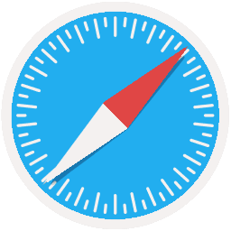 |

## Supported 
This PWA should function on these browsers but some elements may look odd:

|Firefox|Microsoft Edge|
|:-:|:-:|
|  |  |

## Supported 
This PWA is not supported on these browsers, functionality and visuals may not work as expected:

|Internet Explorer|TOR Browser|Other Browsers|
|:-:|:-:|:-:|
|  |  |  |


# Screenshots 

## Desktop 
|Screenshots|
|:-:|
| 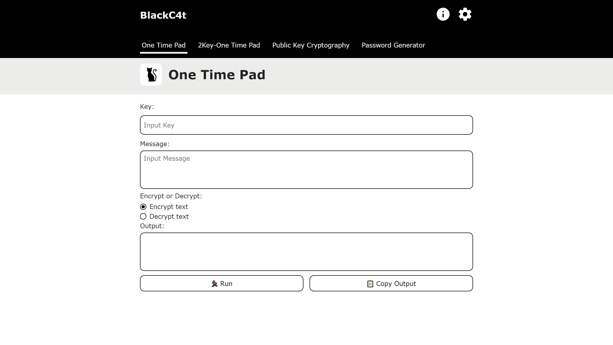 |
| 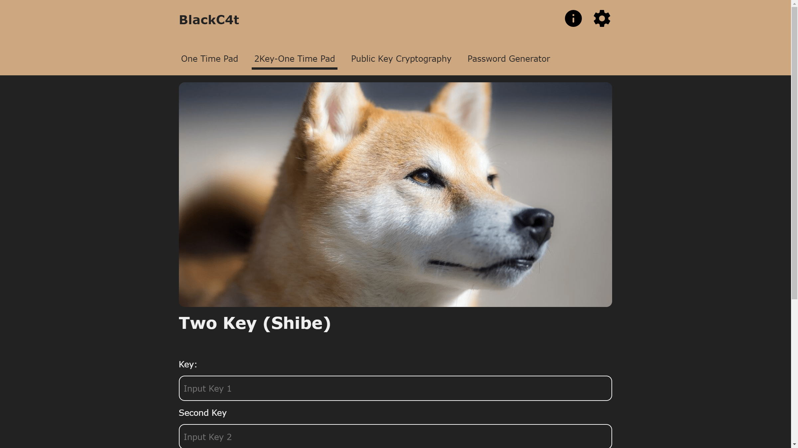 |
| 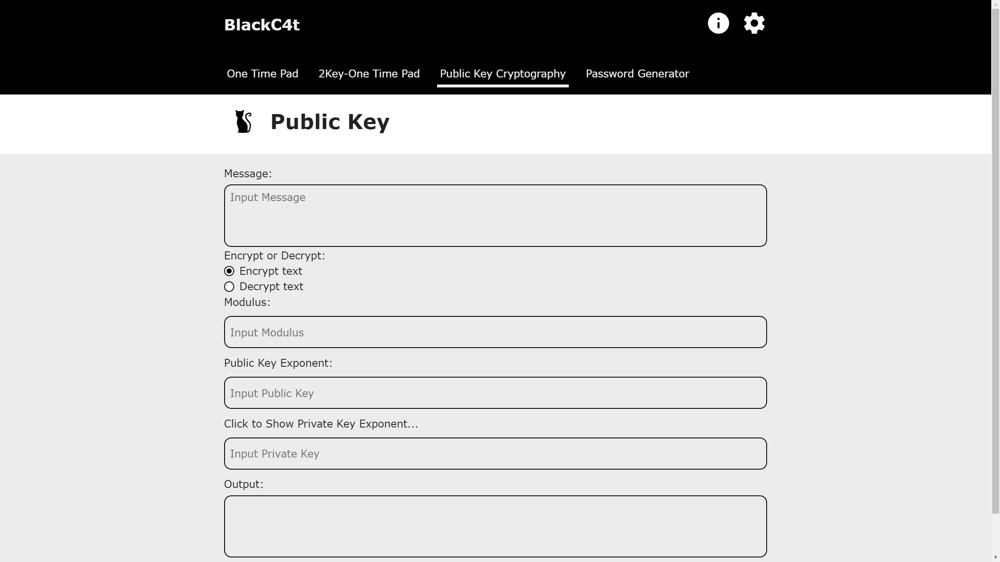 | 


## Mobile 
|Screenshots| |
|:-:|:-:|
| 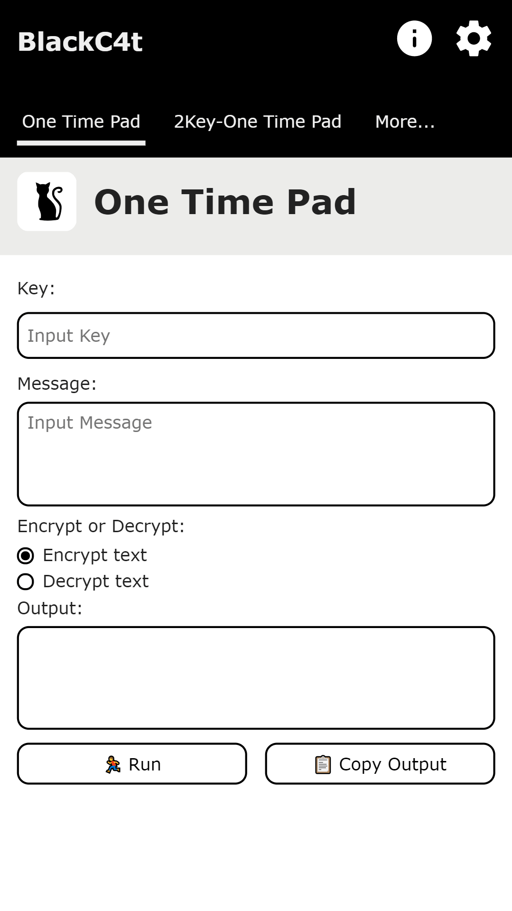 | 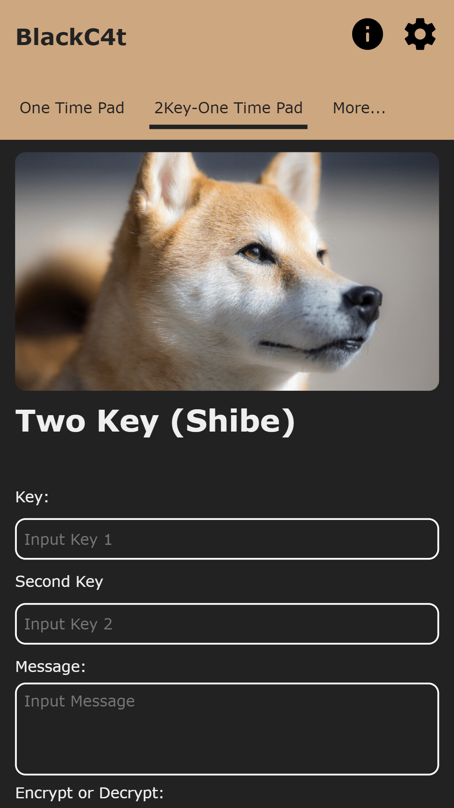 |
| 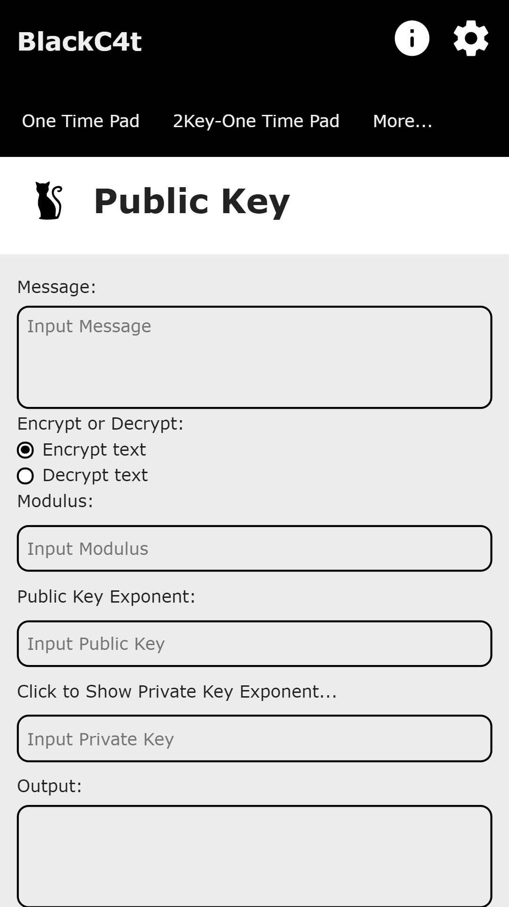 | 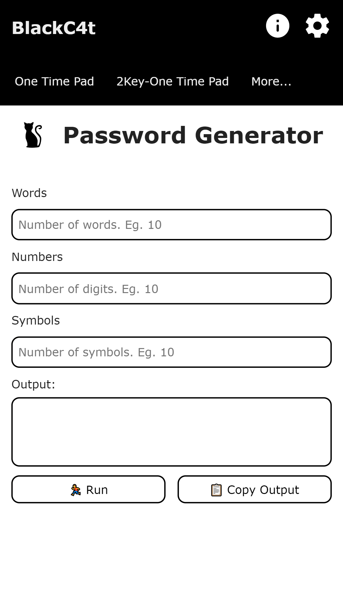 |


## Themes 
|Light|Dark|Black|
|:-:|:-:|:-:|
| 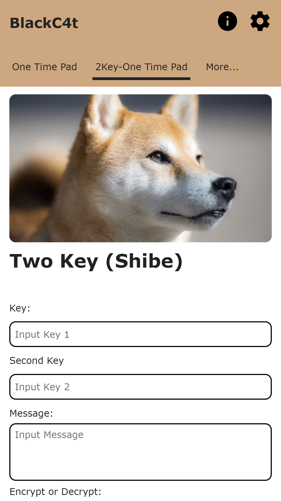 |  | 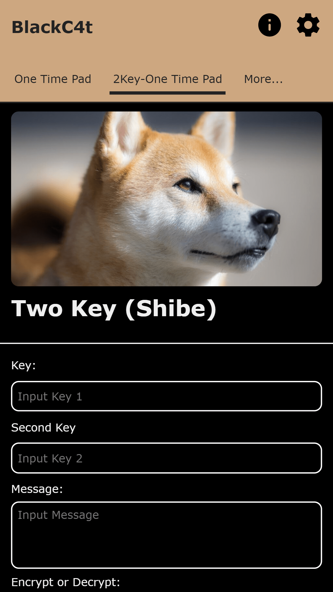 |


# Limited Support
Expect this project to be supported for approximately 6 months (for bug-fixes only).
 Note that this is not guaranteed. Create an issue for bugs
 (as this project is carried out in spare time, you may have 
to wait for a few days)

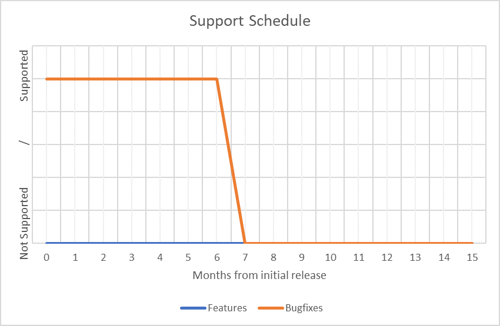


